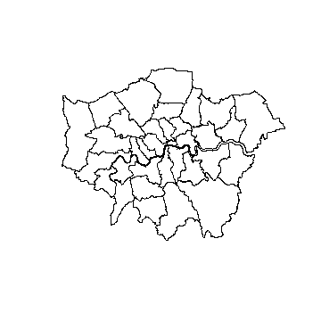
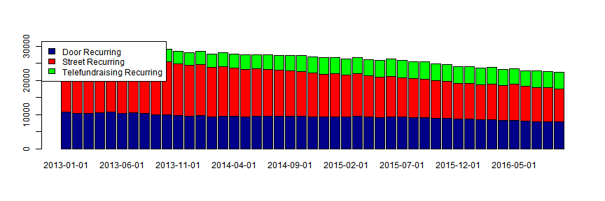

## Why R
<br> </br>

> - # R is free and open source

> - # Reading different data from different platform

> - # Provides different data manipulation packages and functions

> - # Data modelling, forecasting and a lot other analytic functions

> - # Data visualization: basic R plot and interactive plots integrated with Google visualization and javascript libraries 

> - # `shiny` dashboard: integrate analysis output to dashboard and share with others

> - # Markdown Documentation

--- &twocol

## Some stats about R

# R is becoming popular.
<br>
IEEE Spectrum (Institude of Electrical and Electronics Engineers) ranked R fifth in the <a href="http://spectrum.ieee.org/computing/software/the-2016-top-programming-languages">top programming languages of 2016</a>

*** =left
<figure>

<!--<figcaption>2016 Ranking</figcaption>-->
</figure>

*** =right
<figure>

<!--<figcaption>2014 2015 ranking comparison</figcaption>-->
</figure>

<!--

- Bullet 1
- Bullet 2
- Bullet 3

-->


--- .dark .nobackground

<p style='font-size:100px'>
<font color='white'>
R Connectivity 
</font>
</p>


--- 

## Connect to different data

<br> </br>

> - # flat/txt file: `read.table()`

> - # csv file: `read.csv()`

> - # MySQL/SQL database: `odbcConnect("ServerName", uid = "UserName", pwd = "Password")`

> - # Online data

> - # GIS data: `readOGR()`

> - # Graph database: <a href="https://neo4j.com/developer/r/"> `RNeo4j` </a>


--- &twocol

## R to flat file 
<!--
comment = NA helps remove the # in the output
echo = FLASE means only show the final output make all R code and relating comments invisible
prompt = TRUE you will see a little + symbol 
-->

*** =left

Load a txt file into R


```r
df <- read.table("F:\\Work\\Greenpeace\\R Skillshare\\Data\\SMS.txt",
                 header = T,
                 sep = "\t")
head(df)
```

```
  received       mobile contact keyword first.name   surname
1 25/10/16 020 40438140    Male     963      Keith Tongatala
2 25/10/16 020 41202655  Female     963      Julie    Watene
3 25/10/16  021 1057399    Male     963       John  Holloway
4 25/10/16  021 1238972    Male     963      Shane   No Name
5 25/10/16  021 1416171  Female     963     Eunice      Jury
6 25/10/16  021 1445578    Male     963    Brendon   No Name
```
<!--make these two examples side by side-->

*** =right

Load a csv file into R


```r
df <- read.csv("F:\\Work\\Greenpeace\\R Skillshare\\Data\\SMS.csv",
               header = T,
               stringsAsFactors = F)
head(df)
```

```
  received       mobile contact keyword first.name   surname
1 25/10/16 020 40438140    Male     963      Keith Tongatala
2 25/10/16 020 41202655  Female     963      Julie    Watene
3 25/10/16  021 1057399    Male     963       John  Holloway
4 25/10/16  021 1238972    Male     963      Shane   No Name
5 25/10/16  021 1416171  Female     963     Eunice      Jury
6 25/10/16  021 1445578    Male     963    Brendon   No Name
```

---

## R to MySQL and SQL
<style type="text/css">

code.r{ /* Code block */
  font-size: 15px;
}

code.vhdl{

  font-size: 15px;

}


</style>

<!--
Base functions in R don't have the ability to connect to database
R packages needed here

-->

```r
library(RODBC)
RE_connect <- odbcConnect("RE7", uid = "SSRS", pwd = "xH^SfWJ2R4")
gift <- sqlQuery(RE_connect, 
               query = "
               select RECORDS.CONSTITUENT_ID, ... from GiftSplit ...Truncated
               where GIFT.DTE between '2016-09-01' and '2016-09-30'
               and GIFT.TYPE in (31) and (FUND.FUND_ID like '%AQ-PHONE%' or FUND.FUND_ID like '%AQ-DDC%')
               ")
head(gift)
```
<!--

-->

```
  CONSTITUENT_ID        DTE Amount TYPE APPEAL_ID      FUND_ID                     GROUP Year month
1         882766 2014-03-06     40   31  TARC2013 AQ-PHONE2013 Telefundraising Recurring 2014     3
2         287286 2014-03-06     25   31   DTD1310   AQ-DDC2013            Door Recurring 2014     3
3         286957 2014-03-06     30   31   DTD1310   AQ-DDC2013            Door Recurring 2014     3
4         741585 2014-03-06     10   31   DTD1310   AQ-DDC2013            Door Recurring 2014     3
5         723047 2014-03-06    100   31 T_SHARK13 AQ-PHONE2013 Telefundraising Recurring 2014     3
6         286779 2014-03-06     25   31   DTD1309   AQ-DDC2013            Door Recurring 2014     3
```


---

## R to online data

--- &twocol

## R to GIS data

Shapefile and raster data can be imported into R

- Shapefile into R

*** =left

```r
library(rgdal)
london.shp <- readOGR(dsn = "F:\\Work\\Greenpeace\\R Skillshare\\Data\\London", 
    layer = "London_Borough_Excluding_MHW")
plot(london.shp)
```

*** =right



---

## R to GIS data

- Raster data into R

<!--
word temperature data

-->


```r
library(raster)
World.Temp <- getData('worldclim', var = 'tmax', res = 10)
plot(World.Temp)
```


---

## R to Graph database


--- .dark


<p style='font-size:100px'>
<font color='white'>
R data manipulation 
</font>
</p>

--- &twocol

## Data manipulation using base R functions
<!--
data.frame()
aggregate()

The problem of using R base functions to manipulate data is sometimes when the dataset gets larger the process could be slower

why?

It's the problem of how R works

-->

Base function like `aggregate()` gives us the ability to aggregate raw data without using any external packages.

However `aggregate()` is not really efficient when dataset gets larger and aggregation becomes complex. 

*** =left


```r
start.time <- Sys.time()
gift.ag1 <- as.data.frame(as.list(aggregate(Amount ~ Year + month + GROUP,
                      data = gift, 
                      FUN = function(x) c(Count = length(x), Average = mean(x), Total = sum(x)))
                                 )
                         )

Sys.time() - start.time
Time difference of 3.417091 secs
```

*** =right


```
  Year month          GROUP Amount.Count Amount.Average Amount.Total
1 2013     1 Door Recurring        10648       16.94191     180397.5
2 2014     1 Door Recurring         9753       18.46033     180043.6
3 2015     1 Door Recurring         9383       19.80147     185797.2
4 2016     1 Door Recurring         8614       20.28150     174704.9
5 2013     2 Door Recurring        10264       17.15470     176075.8
6 2014     2 Door Recurring         9370       18.67224     174958.9
```


--- &twocol

## Data manipulation using functions from R packages

<!--

data.table() shorter code and memory efficient but hard to learn
dplyr() pipe operator easy to learn but consumes memory


-->

Using external packages like `library(data.table)` can really solve the efficiency problem.

When dealing with large data aggregation, it can shrink the time significantly (Why?).

Other packages like `dplyr`, `reshape2` can also help aggregate data for different purposes


*** =left


```r
library(data.table)
start.time <- Sys.time()
gift.dt <- data.table(gift)
gift.ag <- gift.dt[,list(Count = length(Amount), 
                         Average = mean(Amount), 
                         Total = sum(Amount)), 
                   by = list(Year, month, GROUP)]
Sys.time() - start.time
Time difference of 0.09307098 secs
```


*** =right

```
   Year month                     GROUP Count  Average     Total
1: 2014     3 Telefundraising Recurring  4037 24.68985  99672.92
2: 2014     3            Door Recurring  9486 18.59677 176408.92
3: 2014     3          Street Recurring 14565 15.40297 224344.26
4: 2014     4          Street Recurring 14246 15.17175 216136.76
5: 2014     4            Door Recurring  9448 18.27036 172618.36
6: 2014     4 Telefundraising Recurring  4125 24.63313 101611.67
```


--- .dark

<p style='font-size:100px'>
<font color='white'>
R data visualization 
</font>
</p>

---

## Base R plot
<!--
plot()


-->

> - # `plot()`

> - # `barplot()`

--- 

## Example of stack barplot


```r
barplot(as.matrix(gift.stack[,-1]),
        col=c("darkblue","red", "green"))
legend("topright",
       inset=c(-0.2,0), 
       legend = unique(gift.stack$GROUP), 
       fill = c("darkblue","red", "green"))
```




---

## ggplot2 (<font color="red">G</font>rammar of <font color="red">G</font>raphics)

<br>
# The basic idea of ggplot
> - # ggplot2 deals with long table

> - # ggplot2 pivots a long table into a Excel like pivot table and then visualize the data
       > - specify columns/fields to be used in x and y axis
       > - specify which column/fields you want to break the data by
       > - specify the plot type by adding (`+`) layers on the canvas 
           - geom_bar()
           - geom_line()
           - geom_point()
           - etc
       > - Add other layers to customize colour, label, title, caption and background     

---

## ggplot2
# Example of ggplot


```r
library(ggplot2)
gift.ag <- gift.ag[order(gift.ag$GROUP, descending = FALSE),]

ggplot(data = gift.ag , aes(x=date, y=Count, fill = GROUP)) +
  geom_bar(stat = "identity") +
  ggtitle("Number of Recurring Gift by FR Programme")
```


<!--

<div class="red2">
This text is red
</div>sdfsfdf

-->

--- &twocol

## Interactive plot

- # R itself doesn't have interactive plotting function.

- # External packages can integrate javascript, Google visualization to produce interactive plot

- # The plot below uses Google Motion Chart to show how our fundraising performs over year

*** =left

```r
library(googleVis)
#options(gvis.plot.tag='chart')
gmotion <- gvisMotionChart(gift.ag,
                           idvar = "GROUP",
                           timevar = "date",
                           xvar = "Count",
                           yvar = "Average",
                           options = list(width=400, height=300))
#print(gmotion$html$chart)
print(gmotion, tag = 'chart')
```

*** =right

<!-- MotionChart generated in R 3.3.1 by googleVis 0.6.1 package -->
<!-- Sun Nov 20 21:40:35 2016 -->


<!-- jsHeader -->
<script type="text/javascript">
 
// jsData 
function gvisDataMotionChartID139c665b78bb () {
var data = new google.visualization.DataTable();
var datajson =
[
 [
"Door Recurring",
new Date(2016,7,1),
2016,
8,
7920,
19.69272854,
155966.41
],
[
"Door Recurring",
new Date(2014,5,1),
2014,
6,
9491,
18.74148035,
177875.39
],
[
"Door Recurring",
new Date(2014,2,1),
2014,
3,
9486,
18.59676576,
176408.92
],
[
"Door Recurring",
new Date(2015,11,1),
2015,
12,
8718,
19.9507582,
173930.71
],
[
"Door Recurring",
new Date(2016,0,1),
2016,
1,
8614,
20.28150221,
174704.86
],
[
"Door Recurring",
new Date(2014,6,1),
2014,
7,
9555,
18.77020513,
179349.31
],
[
"Door Recurring",
new Date(2015,1,1),
2015,
2,
9263,
19.93174134,
184627.72
],
[
"Door Recurring",
new Date(2013,4,1),
2013,
5,
10701,
17.68477806,
189244.81
],
[
"Door Recurring",
new Date(2013,5,1),
2013,
6,
10379,
17.77368629,
184473.09
],
[
"Door Recurring",
new Date(2016,6,1),
2016,
7,
7980,
19.71189975,
157300.96
],
[
"Door Recurring",
new Date(2013,8,1),
2013,
9,
10015,
17.93727808,
179641.84
],
[
"Door Recurring",
new Date(2016,8,1),
2016,
9,
7880,
19.81446827,
156138.01
],
[
"Door Recurring",
new Date(2013,9,1),
2013,
10,
10020,
17.91602395,
179518.56
],
[
"Door Recurring",
new Date(2015,0,1),
2015,
1,
9383,
19.80146755,
185797.17
],
[
"Door Recurring",
new Date(2014,1,1),
2014,
2,
9370,
18.67224013,
174958.89
],
[
"Door Recurring",
new Date(2015,3,1),
2015,
4,
9263,
19.71783008,
182646.26
],
[
"Door Recurring",
new Date(2015,4,1),
2015,
5,
9192,
20.10631092,
184817.21
],
[
"Door Recurring",
new Date(2015,7,1),
2015,
8,
9066,
20.10597948,
182280.81
],
[
"Door Recurring",
new Date(2015,9,1),
2015,
10,
8923,
19.95063992,
178019.56
],
[
"Door Recurring",
new Date(2015,10,1),
2015,
11,
8827,
20.0807647,
177252.91
],
[
"Door Recurring",
new Date(2013,2,1),
2013,
3,
10300,
17.28493301,
178034.81
],
[
"Door Recurring",
new Date(2013,3,1),
2013,
4,
10639,
17.30006016,
184055.34
],
[
"Door Recurring",
new Date(2016,2,1),
2016,
3,
8579,
20.0481886,
171993.41
],
[
"Door Recurring",
new Date(2015,6,1),
2015,
7,
9234,
20.01499459,
184818.46
],
[
"Door Recurring",
new Date(2014,3,1),
2014,
4,
9448,
18.27035986,
172618.36
],
[
"Door Recurring",
new Date(2014,4,1),
2014,
5,
9405,
19.00749389,
178765.48
],
[
"Door Recurring",
new Date(2014,0,1),
2014,
1,
9753,
18.46032708,
180043.57
],
[
"Door Recurring",
new Date(2016,1,1),
2016,
2,
8518,
20.30154496,
172928.56
],
[
"Door Recurring",
new Date(2016,3,1),
2016,
4,
8339,
19.97391294,
166562.46
],
[
"Door Recurring",
new Date(2014,9,1),
2014,
10,
9428,
19.07694103,
179857.4
],
[
"Door Recurring",
new Date(2013,1,1),
2013,
2,
10264,
17.15469992,
176075.84
],
[
"Door Recurring",
new Date(2016,4,1),
2016,
5,
8270,
19.94400363,
164936.91
],
[
"Door Recurring",
new Date(2013,7,1),
2013,
8,
10264,
18.00665822,
184820.34
],
[
"Door Recurring",
new Date(2013,11,1),
2013,
12,
9531,
17.93102403,
170900.59
],
[
"Door Recurring",
new Date(2015,8,1),
2015,
9,
9036,
19.90416224,
179854.01
],
[
"Door Recurring",
new Date(2013,0,1),
2013,
1,
10648,
16.94191491,
180397.51
],
[
"Door Recurring",
new Date(2014,7,1),
2014,
8,
9470,
19.10663569,
180939.84
],
[
"Door Recurring",
new Date(2014,8,1),
2014,
9,
9508,
19.13761464,
181960.44
],
[
"Door Recurring",
new Date(2016,5,1),
2016,
6,
8090,
19.7993152,
160176.46
],
[
"Door Recurring",
new Date(2015,5,1),
2015,
6,
9304,
19.9901666,
185988.51
],
[
"Door Recurring",
new Date(2014,11,1),
2014,
12,
9313,
19.42815956,
180934.45
],
[
"Door Recurring",
new Date(2013,6,1),
2013,
7,
10493,
17.55761079,
184232.01
],
[
"Door Recurring",
new Date(2014,10,1),
2014,
11,
9285,
19.42320517,
180344.46
],
[
"Door Recurring",
new Date(2015,2,1),
2015,
3,
9488,
20.05045004,
190238.67
],
[
"Door Recurring",
new Date(2013,10,1),
2013,
11,
9737,
18.43261477,
179478.37
],
[
"Street Recurring",
new Date(2014,3,1),
2014,
4,
14246,
15.17175067,
216136.76
],
[
"Street Recurring",
new Date(2015,9,1),
2015,
10,
10967,
14.59005289,
160009.11
],
[
"Street Recurring",
new Date(2015,3,1),
2015,
4,
12183,
15.05245916,
183384.11
],
[
"Street Recurring",
new Date(2014,4,1),
2014,
5,
13827,
15.14855066,
209459.01
],
[
"Street Recurring",
new Date(2016,3,1),
2016,
4,
10282,
14.89348181,
153134.78
],
[
"Street Recurring",
new Date(2013,0,1),
2013,
1,
17666,
14.61177969,
258131.7
],
[
"Street Recurring",
new Date(2015,10,1),
2015,
11,
10867,
14.54101316,
158017.19
],
[
"Street Recurring",
new Date(2013,2,1),
2013,
3,
16834,
15.12901093,
254681.77
],
[
"Street Recurring",
new Date(2014,0,1),
2014,
1,
14978,
15.16900254,
227201.32
],
[
"Street Recurring",
new Date(2013,3,1),
2013,
4,
16978,
14.82901579,
251767.03
],
[
"Street Recurring",
new Date(2014,1,1),
2014,
2,
14572,
15.67304282,
228387.58
],
[
"Street Recurring",
new Date(2015,6,1),
2015,
7,
11578,
14.73189325,
170565.86
],
[
"Street Recurring",
new Date(2015,8,1),
2015,
9,
11265,
14.57697381,
164209.61
],
[
"Street Recurring",
new Date(2013,9,1),
2013,
10,
15430,
14.81837135,
228647.47
],
[
"Street Recurring",
new Date(2014,8,1),
2014,
9,
13334,
14.97451327,
199670.16
],
[
"Street Recurring",
new Date(2013,5,1),
2013,
6,
16063,
14.56539563,
233963.95
],
[
"Street Recurring",
new Date(2014,10,1),
2014,
11,
12919,
14.98014475,
193528.49
],
[
"Street Recurring",
new Date(2015,0,1),
2015,
1,
12598,
15.13986347,
190732
],
[
"Street Recurring",
new Date(2013,8,1),
2013,
9,
15450,
14.7941767,
228570.03
],
[
"Street Recurring",
new Date(2016,4,1),
2016,
5,
10566,
14.87437157,
157162.61
],
[
"Street Recurring",
new Date(2016,5,1),
2016,
6,
10193,
14.69717159,
149808.27
],
[
"Street Recurring",
new Date(2013,7,1),
2013,
8,
15540,
14.61665701,
227142.85
],
[
"Street Recurring",
new Date(2016,6,1),
2016,
7,
10016,
14.69560503,
147191.18
],
[
"Street Recurring",
new Date(2016,8,1),
2016,
9,
9637,
14.60305282,
140729.62
],
[
"Street Recurring",
new Date(2013,6,1),
2013,
7,
15920,
14.55949372,
231787.14
],
[
"Street Recurring",
new Date(2014,7,1),
2014,
8,
13508,
15.10049674,
203977.51
],
[
"Street Recurring",
new Date(2015,2,1),
2015,
3,
12516,
15.16650607,
189823.99
],
[
"Street Recurring",
new Date(2013,10,1),
2013,
11,
15080,
15.04042971,
226809.68
],
[
"Street Recurring",
new Date(2013,4,1),
2013,
5,
16479,
14.73169913,
242763.67
],
[
"Street Recurring",
new Date(2014,6,1),
2014,
7,
13750,
14.92412655,
205206.74
],
[
"Street Recurring",
new Date(2016,2,1),
2016,
3,
10437,
14.63984957,
152796.11
],
[
"Street Recurring",
new Date(2015,11,1),
2015,
12,
10462,
14.52974861,
152010.23
],
[
"Street Recurring",
new Date(2016,0,1),
2016,
1,
10528,
14.64977774,
154232.86
],
[
"Street Recurring",
new Date(2015,7,1),
2015,
8,
11439,
14.60782761,
167098.94
],
[
"Street Recurring",
new Date(2014,11,1),
2014,
12,
12576,
14.96609256,
188213.58
],
[
"Street Recurring",
new Date(2015,5,1),
2015,
6,
11932,
14.76556235,
176182.69
],
[
"Street Recurring",
new Date(2014,9,1),
2014,
10,
13100,
15.15006336,
198465.83
],
[
"Street Recurring",
new Date(2016,1,1),
2016,
2,
10240,
14.87789941,
152349.69
],
[
"Street Recurring",
new Date(2013,11,1),
2013,
12,
14899,
14.97964964,
223181.8
],
[
"Street Recurring",
new Date(2016,7,1),
2016,
8,
9937,
14.52639227,
144348.76
],
[
"Street Recurring",
new Date(2013,1,1),
2013,
2,
17171,
15.01073962,
257749.41
],
[
"Street Recurring",
new Date(2014,5,1),
2014,
6,
13864,
14.88192369,
206322.99
],
[
"Street Recurring",
new Date(2015,4,1),
2015,
5,
11824,
15.00732493,
177446.61
],
[
"Street Recurring",
new Date(2015,1,1),
2015,
2,
12414,
15.33062752,
190314.41
],
[
"Street Recurring",
new Date(2014,2,1),
2014,
3,
14565,
15.40297013,
224344.26
],
[
"Telefundraising Recurring",
new Date(2014,2,1),
2014,
3,
4037,
24.6898489,
99672.92
],
[
"Telefundraising Recurring",
new Date(2014,3,1),
2014,
4,
4125,
24.63313212,
101611.67
],
[
"Telefundraising Recurring",
new Date(2015,10,1),
2015,
11,
5004,
27.53014388,
137760.84
],
[
"Telefundraising Recurring",
new Date(2013,1,1),
2013,
2,
3170,
21.39705678,
67828.67
],
[
"Telefundraising Recurring",
new Date(2014,4,1),
2014,
5,
4240,
24.91595991,
105643.67
],
[
"Telefundraising Recurring",
new Date(2013,2,1),
2013,
3,
3228,
21.8332311,
70477.67
],
[
"Telefundraising Recurring",
new Date(2014,5,1),
2014,
6,
4238,
24.86778433,
105389.67
],
[
"Telefundraising Recurring",
new Date(2016,0,1),
2016,
1,
4914,
27.2610582,
133960.84
],
[
"Telefundraising Recurring",
new Date(2015,7,1),
2015,
8,
4984,
27.25799358,
135853.84
],
[
"Telefundraising Recurring",
new Date(2016,1,1),
2016,
2,
4807,
27.08489494,
130197.09
],
[
"Telefundraising Recurring",
new Date(2016,2,1),
2016,
3,
4792,
27.12960977,
130005.09
],
[
"Telefundraising Recurring",
new Date(2016,3,1),
2016,
4,
4692,
27.00060529,
126686.84
],
[
"Telefundraising Recurring",
new Date(2014,7,1),
2014,
8,
4366,
25.35982822,
110721.01
],
[
"Telefundraising Recurring",
new Date(2016,4,1),
2016,
5,
4661,
27.29620039,
127227.59
],
[
"Telefundraising Recurring",
new Date(2016,5,1),
2016,
6,
4626,
26.93289883,
124591.59
],
[
"Telefundraising Recurring",
new Date(2016,6,1),
2016,
7,
4733,
27.10581872,
128291.84
],
[
"Telefundraising Recurring",
new Date(2016,7,1),
2016,
8,
4820,
27.17989419,
131007.09
],
[
"Telefundraising Recurring",
new Date(2014,9,1),
2014,
10,
4702,
25.73777329,
121019.01
],
[
"Telefundraising Recurring",
new Date(2013,9,1),
2013,
10,
3819,
23.81118617,
90934.92
],
[
"Telefundraising Recurring",
new Date(2014,10,1),
2014,
11,
4673,
26.12540338,
122084.01
],
[
"Telefundraising Recurring",
new Date(2014,11,1),
2014,
12,
4763,
25.91875079,
123451.01
],
[
"Telefundraising Recurring",
new Date(2013,11,1),
2013,
12,
3787,
23.84669131,
90307.42
],
[
"Telefundraising Recurring",
new Date(2015,1,1),
2015,
2,
4669,
26.15003427,
122094.51
],
[
"Telefundraising Recurring",
new Date(2015,5,1),
2015,
6,
4982,
27.24533521,
135736.26
],
[
"Telefundraising Recurring",
new Date(2013,5,1),
2013,
6,
3703,
23.13655685,
85674.67
],
[
"Telefundraising Recurring",
new Date(2015,0,1),
2015,
1,
4737,
26.02960946,
123302.26
],
[
"Telefundraising Recurring",
new Date(2014,8,1),
2014,
9,
4492,
25.95464381,
116588.26
],
[
"Telefundraising Recurring",
new Date(2013,10,1),
2013,
11,
3839,
24.16571243,
92772.17
],
[
"Telefundraising Recurring",
new Date(2015,3,1),
2015,
4,
4690,
26.38838166,
123761.51
],
[
"Telefundraising Recurring",
new Date(2013,7,1),
2013,
8,
3915,
24.07398978,
94249.67
],
[
"Telefundraising Recurring",
new Date(2014,1,1),
2014,
2,
3845,
24.15375033,
92871.17
],
[
"Telefundraising Recurring",
new Date(2013,0,1),
2013,
1,
3203,
21.47265688,
68776.92
],
[
"Telefundraising Recurring",
new Date(2015,11,1),
2015,
12,
4923,
27.16414585,
133729.09
],
[
"Telefundraising Recurring",
new Date(2014,0,1),
2014,
1,
3861,
24.15932919,
93279.17
],
[
"Telefundraising Recurring",
new Date(2014,6,1),
2014,
7,
4215,
24.98230605,
105300.42
],
[
"Telefundraising Recurring",
new Date(2016,8,1),
2016,
9,
4895,
27.27596323,
133515.84
],
[
"Telefundraising Recurring",
new Date(2015,4,1),
2015,
5,
4792,
26.84244783,
128629.01
],
[
"Telefundraising Recurring",
new Date(2013,8,1),
2013,
9,
3793,
24.29394147,
92146.92
],
[
"Telefundraising Recurring",
new Date(2013,3,1),
2013,
4,
3380,
22.38148521,
75649.42
],
[
"Telefundraising Recurring",
new Date(2013,4,1),
2013,
5,
3550,
22.83652676,
81069.67
],
[
"Telefundraising Recurring",
new Date(2015,6,1),
2015,
7,
5001,
27.14117377,
135733.01
],
[
"Telefundraising Recurring",
new Date(2013,6,1),
2013,
7,
3906,
23.69608807,
92556.92
],
[
"Telefundraising Recurring",
new Date(2015,8,1),
2015,
9,
5116,
27.5842631,
141121.09
],
[
"Telefundraising Recurring",
new Date(2015,9,1),
2015,
10,
5081,
27.51896083,
139823.84
],
[
"Telefundraising Recurring",
new Date(2015,2,1),
2015,
3,
4727,
26.63163952,
125887.76
] 
];
data.addColumn('string','GROUP');
data.addColumn('date','date');
data.addColumn('number','Year');
data.addColumn('number','month');
data.addColumn('number','Count');
data.addColumn('number','Average');
data.addColumn('number','Total');
data.addRows(datajson);
return(data);
}
 
// jsDrawChart
function drawChartMotionChartID139c665b78bb() {
var data = gvisDataMotionChartID139c665b78bb();
var options = {};
options["width"] = 400;
options["height"] = 300;
options["state"] = "\n{\"xAxisOption\":\"4\",\"yAxisOption\":\"5\",\"dimensions\":{\"iconDimensions\":[\"dim0\"]}}\n";

    var chart = new google.visualization.MotionChart(
    document.getElementById('MotionChartID139c665b78bb')
    );
    chart.draw(data,options);
    

}
  
 
// jsDisplayChart
(function() {
var pkgs = window.__gvisPackages = window.__gvisPackages || [];
var callbacks = window.__gvisCallbacks = window.__gvisCallbacks || [];
var chartid = "motionchart";
  
// Manually see if chartid is in pkgs (not all browsers support Array.indexOf)
var i, newPackage = true;
for (i = 0; newPackage && i < pkgs.length; i++) {
if (pkgs[i] === chartid)
newPackage = false;
}
if (newPackage)
  pkgs.push(chartid);
  
// Add the drawChart function to the global list of callbacks
callbacks.push(drawChartMotionChartID139c665b78bb);
})();
function displayChartMotionChartID139c665b78bb() {
  var pkgs = window.__gvisPackages = window.__gvisPackages || [];
  var callbacks = window.__gvisCallbacks = window.__gvisCallbacks || [];
  window.clearTimeout(window.__gvisLoad);
  // The timeout is set to 100 because otherwise the container div we are
  // targeting might not be part of the document yet
  window.__gvisLoad = setTimeout(function() {
  var pkgCount = pkgs.length;
  google.load("visualization", "1", { packages:pkgs, callback: function() {
  if (pkgCount != pkgs.length) {
  // Race condition where another setTimeout call snuck in after us; if
  // that call added a package, we must not shift its callback
  return;
}
while (callbacks.length > 0)
callbacks.shift()();
} });
}, 100);
}
 
// jsFooter
</script>
 
<!-- jsChart -->  
<script type="text/javascript" src="https://www.google.com/jsapi?callback=displayChartMotionChartID139c665b78bb"></script>
 
<!-- divChart -->
  
<div id="MotionChartID139c665b78bb" 
  style="width: 400; height: 300;">
</div>


--- .dark

<p style='font-size:100px'>
<font color='white'>
R shiny dashboard 
</font>
</p>

---
## Integrate R output with dashboard

<br></br>

> - # [shiny](http://shiny.rstudio.com/tutorial/) is an external R package (`library(shiny)`) that can be used to integrated analysis results and share with others.

> - # Shiny application can make the results from your output interactive and dynamic.

> - # Structure of a shiny application
       > - ui.R: <br>
           Control the layout, `input` value and present `output`.
       > - server.R:<br>
           Process the calculation based on the `input` value and produce `output`.
       > - global.R (optional):<br>
           Preload static information needed

---

## Realtion between ui.R and server.R

<!-- -->
<br></br>
<center></center>


---

## Shiny application demo

<br></br>

> - # Demo 1: <br>
    # Google Motion Chart and Twitter WordCloud
    
> - # Demo 2: <br>
    # [Saves Report](https://martinhyy.shinyapps.io/SaveReport/) for Supporter Relationship Team
    
> - # Demo 3: <br>
    # [Geographic Gallery](https://martinhyy.shinyapps.io/ShinyApp/)


---
## Publish/deploy dashboard online

--- .dark

<p style='font-size:100px'>
<font color='white'>
Write document in R
</font>
</p>

---
## Knitr in R

---
## Presentation in R slidify

---


